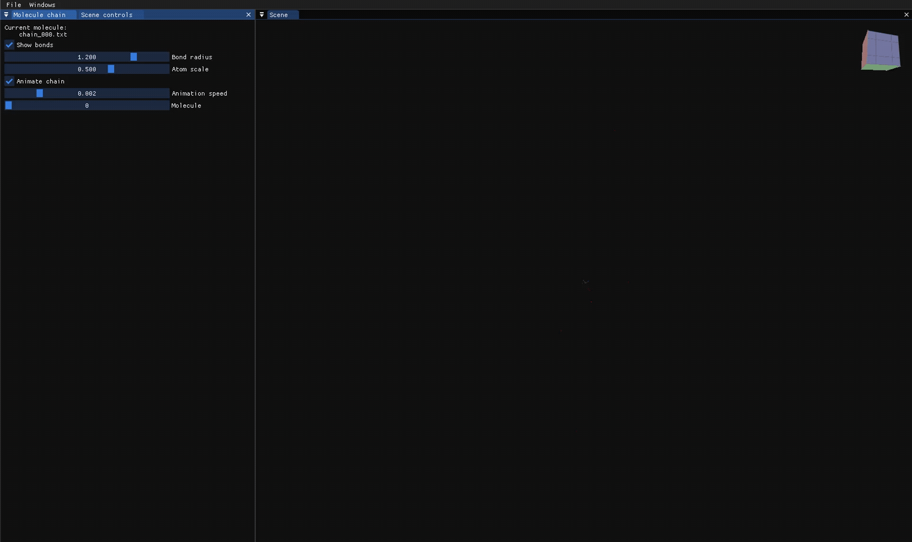

# GeoLDMViz

3D visualizer app for inspecting generated molecules &amp; diffusion chain output from [GeoLDM](https://github.com/MinkaiXu/GeoLDM).
* [Demo video](https://youtu.be/W7b-lYCAOLQ)
* [Blog post](https://karlhiner.com/geoldm_viz)



## Build app

### Install dependencies

#### Mac

Only Mac supported currently.

```shell
$ brew install glew llvm eigen
```

```shell
$ git clone --recurse-submodules git@github.com:khiner/GeoLDMViz.git
$ cd GeoLDMViz
```

- **Clean:**
  - Clean up everything: `./script/Clean`
  - Clean debug build only: `./script/Clean -d [--debug]`
  - Clean release build only: `./script/Clean -r [--release]`
- **Build:**
  - Debug build (default): `./script/Build`
  - Release build: `./script/Build -r [--release]`

Debug build is generated in the `./build` directory relative to project (repo) root.
Release build is generated in `./build-release`.

To run the freshly built application:

```sh
# The application assumes it's being run from the build directory when locating resource files.
$ cd build # or build-release
$ .GeoLDMViz/
```
